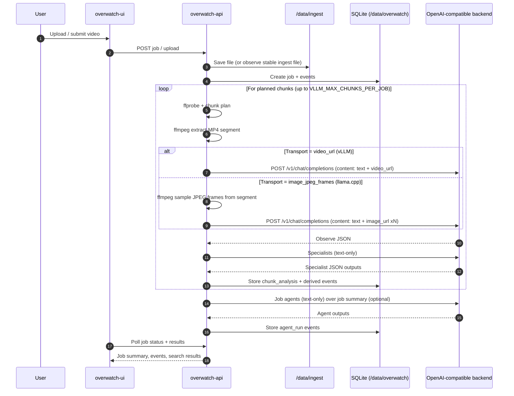

# Architecture

Overwatch is an agentic video analytics system that ingests videos, runs a pipeline to extract structured events, stores results, and exposes them via an API and web UI.

This document describes the runtime components, data flow, and how the LLM/VLM backend integrates (external vLLM vs local `llama.cpp`).

## Architecture diagram

```mermaid
flowchart LR
  subgraph Browser["User browser"]
    UI["Overwatch UI (React)"]
  end

  subgraph Compose["Docker Compose network"]
    NGINX["overwatch-ui (nginx)\n:80"]
    API["overwatch-api (FastAPI)\n:8080"]
    DB["SQLite + artifacts\n./data/overwatch"]
    ING["Ingest dir\n./data/ingest"]
    HC["HuggingFace cache\nhf-cache volume"]
  end

  subgraph Backends["OpenAI-compatible backend (choose one)"]
    VLLM["External vLLM\n/video_url multimodal"]
    LLCP["Local llama.cpp server\n(image_url multimodal)\n(overwatch-vlm :9000)"]
  end

  UI -->|HTTP| NGINX
  NGINX -->|reverse-proxy /v1/* /api/*| API

  API <--> DB
  API <--> ING
  API <--> HC

  API -->|POST /v1/chat/completions\nobserve (multimodal)| Backends
  API -->|POST /v1/chat/completions\nspecialists + agents (text)| Backends

  Backends --> VLLM
  Backends --> LLCP
```

## Project map (what lives where)

### Repository layout

- **`src/overwatch/`**: backend application code
  - **`main.py`**: FastAPI app entrypoint (served by uvicorn in `Dockerfile`)
  - **`api/routes.py`**: HTTP API routes (`/v1/*`, `/api/*`, docs)
  - **`worker.py`**: async job loop (ingest → analysis → agents → events)
  - **`store.py`**: SQLite persistence (jobs, events, agent runs)
  - **`config.py`**: environment-driven settings (`.env` + compose env)
  - **`analysis/`**: chunk analysis pipeline and JSON-structured LLM passes
    - **`analysis/chunk_pipeline.py`**: observe + specialists; transport switching (`video_url` vs `image_url` frames)
  - **`vllm_client.py`**: OpenAI-style HTTP client helpers (`/models`, `/chat/completions`)
  - **`video/`**: ffmpeg/ffprobe helpers
    - **`video/segment.py`**: chunk MP4 extraction (`ffmpeg`)
    - **`video/jpeg_frames.py`**: still-frame sampling from MP4 (for llama.cpp multimodal)
    - **`video/frames.py`**: frame extraction for indexing
  - **`search/`**: hybrid RAG (ChromaDB + BM25 + fusion) and frame search
    - **`search/indexer.py`**, **`search/retrieval.py`**, **`search/frame_indexer.py`**
  - **`agents/`**: job-level text agents + skill runner
- **`frontend/`**: React + Vite UI
- **`docs/`**: deployment notes and reports
- **Compose files**
  - **`compose.yml`**: Overwatch stack (optionally includes local vLLM profile)
  - **`llama-cpp.yml`**: llama.cpp server service (for dual-file compose usage)
  - **`compose.llama-cpp.yml`**: integrated “Overwatch + llama.cpp” stack

### Runtime ports

- **`overwatch-ui`**: host **80** → nginx in container
- **`overwatch-api`**: **8080** inside container (typically not published; reached via nginx)
- **`overwatch-vlm`** (`llama.cpp`): host **9000** → `/v1/*` OpenAI-compatible API
- **`vllm-server`** (optional profile in `compose.yml`): host **10802**

### Persistent data on host

- **`./data/ingest/`**: drop videos here for ingest (mounted at `/data/ingest`)
- **`./data/overwatch/`**: SQLite database + job artifacts (mounted at `/data/overwatch`)
- **`hf-cache`** (Docker named volume): HuggingFace cache used by embeddings/SigLIP

## Components

- **`overwatch-ui`** (container): Static web UI (served via nginx) on port **80**.
- **`overwatch-api`** (container): FastAPI app (HTTP on **8080** inside container; exposed via UI proxy).
  - Handles uploads, job orchestration, event storage, search queries, and agent runs.
  - Calls the configured OpenAI-compatible backend for multimodal “observe” and text-only specialist/agent steps.
- **OpenAI-compatible backend** (external or local):
  - **External vLLM**: recommended for best multimodal support (`video_url`).
  - **Local `llama.cpp` server** (`overwatch-vlm` in `compose.llama-cpp.yml`): OpenAI-style chat endpoint with **image-based** multimodal input.
- **Storage**:
  - Bind mounts:
    - `./data/ingest` → files to ingest
    - `./data/overwatch` → SQLite DB + job artifacts
  - Named volume:
    - `hf-cache` → HuggingFace cache (SigLIP + embeddings and related weights)

## High-level data flow

1. **Ingest**
   - Video files appear in `INGEST_DIR` (default `/data/ingest` inside the container; backed by `./data/ingest`).
   - The worker polls for stable files and creates a **job**.

2. **Probe + chunk planning**
   - The pipeline probes the video (`ffprobe`) and plans chunk boundaries.

3. **Chunk extraction**
   - For each chunk, Overwatch extracts a short MP4 segment via `ffmpeg` (resized and compressed to stay under size limits).

4. **Multimodal “observe” pass**
   - Sends the chunk to the OpenAI-compatible backend to obtain a strict JSON observation schema.
   - **Transport depends on backend capabilities**:
     - **vLLM** transport: `content[].type = "video_url"` with a `data:video/mp4;base64,...` URI
     - **llama.cpp** transport: `content[].type = "image_url"` with multiple JPEG stills sampled from the chunk

5. **Text-only specialist passes**
   - Runs several text-only calls over the observed JSON to produce:
     - main events
     - security + logistics items
     - attendance counts

6. **Store + index**
   - Events are written to SQLite.
   - Optional: search indexing (hybrid text + embeddings) and frame search (SigLIP embeddings).

7. **UI**
   - UI reads via API endpoints and renders jobs, events, and search results.

## Sequence diagram (one job)



## LLM/VLM integration

### Key configuration knobs

All are set via environment variables (in compose files or `.env`) and loaded by `src/overwatch/config.py`.

- **`VLLM_BASE_URL`**: OpenAI-compatible API base (must include `/v1`).
  - Examples:
    - `http://overwatch-vlm:9000/v1` (local `llama.cpp` on the same compose network)
    - `https://your-vllm-host.example.com/v1` (external vLLM)
- **`VLLM_MODEL`**: model name alias to send in requests (default `gemma4`).
- **`VLLM_MULTIMODAL_ENABLED`**: enable chunk observe calls (default `true`).
- **`VLLM_CHUNK_MULTIMODAL_TRANSPORT`**: how the observe step is sent:
  - **`video_url`** (default): MP4 data-URI in OpenAI message content (works for vLLM setups that accept `video_url`)
  - **`image_jpeg_frames`**: sample JPEG stills and send as `image_url` parts (required for `llama.cpp` server)

### Why `llama.cpp` needs `image_jpeg_frames`

`llama.cpp`’s OpenAI-compatible chat endpoint supports image inputs via `image_url`, but it does **not** accept `video_url` content blocks. When configured with:

- `VLLM_CHUNK_MULTIMODAL_TRANSPORT=image_jpeg_frames`

Overwatch uses `ffmpeg` to sample a small number of JPEG frames from each chunk and sends them as multiple `image_url` parts, in chronological order.

## Deployment modes

### Mode A: Local `llama.cpp` (single compose file)

Use `compose.llama-cpp.yml`:

- Runs `overwatch-vlm` (`llama.cpp`) + `overwatch-api` + `overwatch-ui` on one Docker network.
- Sets:
  - `VLLM_BASE_URL` default → `http://overwatch-vlm:9000/v1`
  - `VLLM_CHUNK_MULTIMODAL_TRANSPORT` default → `image_jpeg_frames`

### Mode B: External vLLM (existing stack)

Use `compose.yml` and point Overwatch at an external backend by setting:

- `VLLM_BASE_URL=<external>/v1`
- (optional) `VLLM_API_KEY`, `VLLM_MODEL`

No changes are required to `compose.yml`; the code default transport remains `video_url`, preserving existing behavior.

## “Complete project info” quick reference

### Core environment variables

- **Data**: `DATA_DIR`, `INGEST_DIR`
- **LLM backend**: `VLLM_BASE_URL`, `VLLM_MODEL`, `VLLM_API_KEY`
- **Chunking + multimodal**: `VLLM_MULTIMODAL_ENABLED`, `VLLM_MAX_CHUNKS_PER_JOB`, `VLLM_CHUNK_TIMEOUT_SEC`, `VLLM_CHUNK_MAX_TOKENS`
- **Transport switch**: `VLLM_CHUNK_MULTIMODAL_TRANSPORT` (`video_url` | `image_jpeg_frames`)
- **Limits**: `VLLM_SEGMENT_MAX_BYTES`, `VLLM_VIDEO_SCALE_WIDTH`, `VLLM_SEGMENT_INCLUDE_AUDIO`
- **Retries**: `VLLM_JSON_RETRY_MAX`
- **Specialists + agents**: `VLLM_SPECIALIST_MAX_TOKENS`, `VLLM_AGENT_MAX_TOKENS`, `VLLM_AGENT_TIMEOUT_SEC`

### Search + SigLIP (feature flags)

Overwatch can run without search, but when enabled it adds:

- **Hybrid RAG**: `SEARCH_ENABLED=true|false`
- **Answer synthesis**: `SEARCH_ANSWER_ENABLED=true|false`
- **Frame search**: `FRAME_SEARCH_ENABLED=true|false`

See `src/overwatch/config.py` for the full list (thresholds, prompts, and model IDs).

## Operational notes

- **FFmpeg required**: both chunk extraction and JPEG still extraction use `ffmpeg` inside the API container image.
- **Size limits**: chunk MP4 segments are capped by `VLLM_SEGMENT_MAX_BYTES` and re-encoded smaller if needed.
- **Healthchecks**:
  - `overwatch-vlm` exposes `/health`
  - `overwatch-api` exposes `/v1/health`

