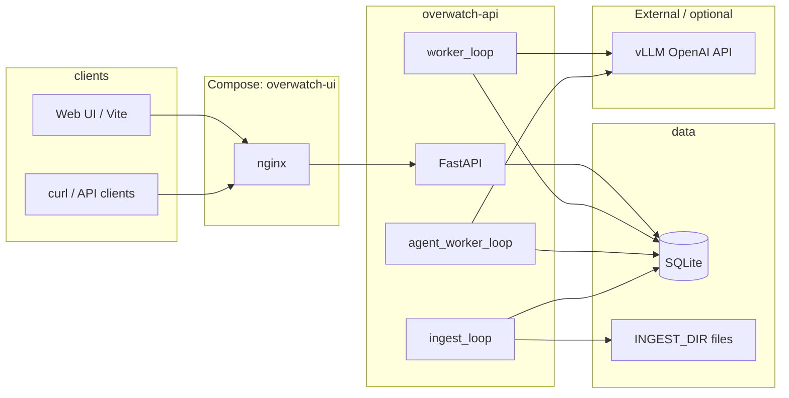

# Overwatch — Technical Report (Engineering)

**Audience:** software engineers, SREs, ML engineers integrating vLLM  
**Scope:** repository as of this document; aligns with `README.md` and source under `src/overwatch/`  
**Approximate length:** ~10 printed pages (dense reference)

---

## 1. Purpose and scope

Overwatch is a **video analytics pipeline** that:

1. Accepts video via **folder ingest** or **HTTP multipart upload**.
2. Decodes video into **time-bounded chunks**, runs a **multimodal LLM** (OpenAI-compatible chat completions with embedded MP4) for observation, then **text-only** specialist passes per chunk.
3. Persists structured results as **events** in SQLite and rolls them into a **job-level summary** (`JobSummaryPayload`).
4. Runs **job-level text agents** over that summary (same vLLM stack), optionally in **linear orchestrations** or **industry-specific static pipelines**.

**Explicitly out of scope for this report:** product roadmap beyond what exists in code, legal/compliance sign-off for any deployment, and performance benchmarks (unless measured in your environment).

**Planned (not implemented):** Google ADK, A2A, SAM-based logistics — noted in README only.

---

## 2. High-level architecture



- **Single API process** hosts HTTP, **job worker**, **agent worker**, and **folder ingest** loop (asyncio tasks, see `main.py` lifespan).
- **SQLite** is the system of record: jobs, events, agent runs, orchestrations.
- **vLLM** is accessed over HTTP (`httpx`); no embedded inference server in the default API container.

---

## 3. Runtime processes (within the API container)

| Task | Module | Role |
|------|--------|------|
| HTTP server | `overwatch.api.routes` | REST API under `/v1` |
| Job worker | `overwatch.worker.worker_loop` | Claims `pending` jobs, runs chunk pipeline until completed/failed |
| Agent worker | `overwatch.agents.runner.agent_worker_loop` | Claims `pending` `agent_runs`, executes one agent, advances orchestration |
| Folder ingest | `overwatch.ingest.folder.FolderIngest` | Scans `INGEST_DIR`, stable-write detection, creates jobs |
| Stale agent sweep | inside `agent_worker_loop` | Periodic `fail_stale_agent_runs` when queue idle |

**Startup / shutdown:** `lifespan` opens DB, registers tasks, sets `asyncio.Event` stop on shutdown, cancels all three loops and closes connection (`main.py`).

---

## 4. Technology stack

| Layer | Choice |
|-------|--------|
| Language | Python 3 |
| API | FastAPI, Starlette middleware |
| DB | SQLite via `aiosqlite`, schema in `db.py` |
| Config | `pydantic-settings` (`config.py`), env + optional `.env` |
| HTTP client | `httpx` (vLLM, long timeouts for large bodies) |
| Frontend | React + Vite; production build behind nginx |
| Containers | Docker Compose; optional GPU profile for local vLLM |

**Model interface:** OpenAI-style `POST …/chat/completions` with multimodal content (`video_url` data URI) for chunk observation; text-only messages for specialists and job agents.

---

## 5. Data model

### 5.1 Tables (authoritative: `src/overwatch/db.py`)

- **`jobs`** — `id`, `source_type`, `source_path`, `status`, timestamps, `error`, `meta_json`, **`summary_json`** (added by migration).
- **`events`** — append-only log: `job_id`, `observed_at`, optional `frame_index` / `pts_ms`, `agent` (enum string), `event_type`, `severity`, `payload_json`.
- **`processed_files`** — ingest deduplication: path, fingerprint, `job_id`.
- **`agent_runs`** — async agent queue: `id`, `job_id`, `agent`, `status`, `force_run`, timestamps, `error`, `result_json`, `event_id`, `meta_json` (includes orchestration linkage keys when applicable).
- **`agent_orchestrations`** — multi-step runs: `steps_json`, `current_step`, `force_run`, **`industry_pack`** (nullable), `status`, `error`, timestamps.

Indexes: `events` by `job_id`, `jobs` by `status`, `agent_runs` by job/status, orchestrations by job/status.

### 5.2 Key domain enums (Pydantic / `models.py`)

- **`JobStatus`:** `pending`, `processing`, `completed`, `failed`
- **`AgentTrack`:** pipeline attribution on events (`main_events`, `security`, `logistics`, `attendance`, `pipeline`, `orchestrator`)
- **`AgentKind`:** job-level agents (`synthesis`, `risk_review`, `incident_brief`, `compliance_brief`, `loss_prevention`, `perimeter_chain`, `privacy_review`)
- **`IndustryPack`:** vertical label for named pipelines (`general`, `retail_qsr`, … `healthcare_facilities`)

---

## 6. Job lifecycle and chunk pipeline

### 6.1 Job creation

- **API:** `POST /v1/jobs` with `filename` or `source_path` under `INGEST_DIR`; `POST /v1/jobs/upload` streams file to ingest dir and creates job.
- **Ingest:** New stable files get fingerprint; duplicate active job for same path is avoided where enforced in store.

### 6.2 Worker behaviour (summary)

For each claimed job (must have vLLM configured for full behaviour):

1. **Plan chunks** — temporal segmentation with caps (`VLLM_MAX_CHUNKS_PER_JOB`, segment byte limit, ffmpeg scale, optional audio).
2. **Per chunk:** multimodal **observe** → structured JSON; **specialists** (main events, security+logistics, attendance counts only); merge to **`ChunkAnalysisMerged`**; append events.
3. **Complete job** — build `JobSummaryPayload`, write `summary_json`, set job `completed`.

Failure at any step sets job `failed` with error string; partial events may exist for debugging.

**Reference modules:** `worker.py`, `analysis/chunk_pipeline.py`, `analysis/json_extract.py`, `vllm_client.py` (`chunk_video_user_messages`).

---

## 7. Job-level agents

All seven agents:

- Input: **`job.summary`** (dict), truncated consistently (~200k chars) inside each agent module when serialized to prompt.
- Output: Pydantic result model → JSON in orchestrator **event** payload + `agent_runs.result_json`.
- **Caching:** If `force_run` is false, worker checks latest successful orchestrator event for that `event_type`; on hit, completes run with `meta.cached` and same result.

**Event type strings** (orchestrator): `agent_synthesis`, `agent_risk_review`, `agent_incident_brief`, `agent_compliance_brief`, `agent_loss_prevention`, `agent_perimeter_chain`, `agent_privacy_review`.

**Dispatch:** `agents/runner.py` maps `AgentKind` → runner function and event type; avoids a long `if/elif` chain via dicts (`_AGENT_RUNNERS`, `_EVENT_TYPE`, `_AGENT_PAYLOAD_ID`).

---

## 8. Orchestration

### 8.1 Single-agent queue

`POST /v1/jobs/{id}/agent-runs` → creates row `pending`; agent worker claims with `UPDATE … RETURNING` (atomic).

### 8.2 Linear custom steps

`POST /v1/jobs/{id}/agent-runs/orchestrate` — body `steps: AgentKind[]` (max 24). First run enqueued with `meta.orchestration_id`, `orch_step`, `orch_steps`. On each terminal success, `notify_agent_orchestration_terminal` enqueues next or marks orchestration `completed`. On failure, orchestration `failed`.

**Concurrency rule:** at most one orchestration with `status=running` per job (`409` on conflict).

### 8.3 Industry static graphs

`POST /v1/jobs/{id}/agent-runs/orchestrate/industry` — body `industry: IndustryPack`. Steps resolved by `industry_pipelines.pipeline_for()`. **`industry_pack`** persisted on `agent_orchestrations` for audit and returned in GET responses.

**Design intent:** explicit, version-controlled graphs per vertical before introducing LLM-driven routing or conditional DAGs.

---

## 9. HTTP API surface (engineering cheat sheet)

Base path: **`/v1`** (Compose also exposes `/api/*` → same API from UI).

| Area | Methods | Notes |
|------|---------|--------|
| Health | `GET /health` | |
| Jobs | `GET/POST /jobs`, `GET /jobs/{id}`, upload | Upload: `413` over `MAX_UPLOAD_BYTES` |
| Events | `GET /jobs/{id}/events` | Pagination `after_id`, `limit`; `legacy=true` full dump |
| Summary | `GET /jobs/{id}/summary` | 404 until summary exists |
| Agent runs | `POST …/agent-runs`, `GET /agent-runs/{id}`, list by job | 202 async |
| Orchestrate | `POST …/agent-runs/orchestrate`, `POST …/orchestrate/industry` | 409 if orchestration running |
| Orchestration status | `GET /agent-orchestrations/{id}`, list by job | Includes `industry_pack` when set |
| Latest agent payloads | `GET …/agents/{kind}` | One route per agent family |
| Synthesis legacy | `POST …/agents/synthesis` | `blocking=true` synchronous path |

**Contract discovery:** FastAPI `/docs`, `/redoc`, `openapi.json` (proxied in Compose).

---

## 10. Cross-cutting concerns

### 10.1 Middleware (order: outer → inner on request)

1. **RequestLogMiddleware** — `X-Request-Id`, latency log at INFO.
2. **CORS** — configurable origins; Compose same-origin UI often bypasses need.
3. **ApiRateLimitMiddleware** — in-memory sliding window per client key (`X-Forwarded-For` first); disabled when `API_RATE_LIMIT_PER_MINUTE=0`. Health/docs/openapi exempt.

### 10.2 Observability

- Structured-ish logs: `overwatch.http`, worker exceptions, `vllm_client` chat completion duration + status.
- No distributed tracing in-tree; single process.

### 10.3 Security posture (engineering reality)

- **No authentication/authorization** on API in current codebase — treat as internal network or add gateway auth.
- **Upload limits** and optional **rate limiting** reduce abuse surface.
- **Secrets:** `VLLM_API_KEY`, `HF_TOKEN` (local vLLM profile) via env — never commit.

### 10.4 Privacy product rules

- Attendance path designed for **counts only**; **privacy_review** agent flags risky wording in structured summary; not a substitute for legal review.

---

## 11. Configuration reference

Environment variables are loaded via `Settings` (`config.py`). High-impact knobs:

| Category | Variables |
|----------|-----------|
| Paths | `DATA_DIR`, `INGEST_DIR` |
| Ingest | `INGEST_POLL_INTERVAL_SEC`, `INGEST_STABLE_SEC`, `INGEST_EXTENSIONS` |
| vLLM core | `VLLM_BASE_URL`, `VLLM_MODEL`, `VLLM_API_KEY` |
| Chunk / multimodal | `VLLM_MAX_CHUNKS_PER_JOB`, `VLLM_CHUNK_TIMEOUT_SEC`, `VLLM_CHUNK_MAX_TOKENS`, `VLLM_SEGMENT_MAX_BYTES`, `VLLM_VIDEO_SCALE_WIDTH`, `VLLM_SEGMENT_INCLUDE_AUDIO`, `VLLM_MULTIMODAL_ENABLED` |
| Text specialists | `VLLM_SPECIALIST_MAX_TOKENS`, `VLLM_JSON_RETRY_MAX` |
| Job agents | `VLLM_AGENT_MAX_TOKENS`, `VLLM_AGENT_TIMEOUT_SEC` |
| Workers | `WORKER_POLL_INTERVAL_SEC`, `AGENT_WORKER_POLL_INTERVAL_SEC` |
| Hardening | `MAX_UPLOAD_BYTES`, `AGENT_RUN_STALE_SEC`, `API_RATE_LIMIT_PER_MINUTE` |
| CORS | `CORS_ORIGINS` |

Compose passes a subset explicitly; others rely on defaults or host `.env`.

---

## 12. Frontend (reference)

- **Dev:** Vite dev server, `/api/*` → `http://127.0.0.1:8080/v1/*`.
- **Prod (Compose):** Static assets + nginx gateway on port 80; proxies `/v1/`, `/api/`, docs, health.
- **Features:** upload, recent jobs polling, summary + per-agent panels, core/cross-industry orchestration buttons, industry dropdown + industry pipeline.

---

## 13. Testing

```bash
PYTHONPATH=src python -m unittest discover -s tests -p 'test_*.py' -v
```

**Modules covered (representative):** JSON extraction, chunk planning, agent run store + stale failure, orchestration advancement, industry pipeline definitions, each job-level agent with mocked vLLM.

**Gaps (honest):** no full HTTP integration suite in repo; no load tests; no golden eval for agent quality.

---

## 14. Deployment (Compose)

- **Services:** `overwatch-api` (build from repo Dockerfile), `overwatch-ui` (frontend Dockerfile), optional `vllm-server` (`--profile local-vllm`).
- **Volumes:** `./data/ingest`, `./data/overwatch` → `/data/ingest`, `/data/overwatch`.
- **Health:** API `curl` healthcheck; UI `depends_on` API healthy.
- **Host port 80:** may require elevated/rootless Docker port mapping adjustments (see README).

---

## 15. Known limitations and extension points

| Limitation | Implication |
|------------|-------------|
| Summary-bound agents | Quality ceiling = chunk pipeline + summary fidelity |
| Single SQLite file | Throughput and HA not designed for multi-writer scale-out |
| Single API replica | Agent/job workers are in-process; horizontal scale needs redesign |
| No auth | Must be network-segmented or wrapped |
| Static industry graphs only | Conditional branches / LLM router not implemented |

**Extension points:** enrich `JobSummaryPayload` / chunk merges; add conditional orchestration after risk/privacy; external queue (Redis) for workers; OpenAPI-first SDK generation.

---

## 16. Appendix: repository map

| Path | Responsibility |
|------|----------------|
| `src/overwatch/main.py` | FastAPI app, lifespan, middleware stack |
| `src/overwatch/config.py` | Settings / env |
| `src/overwatch/db.py` | SQLite schema + migrations |
| `src/overwatch/store.py` | Persistence API |
| `src/overwatch/api/routes.py` | REST endpoints |
| `src/overwatch/worker.py` | Job processing loop |
| `src/overwatch/agents/runner.py` | Agent execution + orchestration hooks |
| `src/overwatch/agents/orchestration.py` | Orchestration advance/fail |
| `src/overwatch/agents/*.py` | Per-agent LLM modules |
| `src/overwatch/industry_pipelines.py` | `INDUSTRY_PIPELINES`, `pipeline_for()` |
| `src/overwatch/models.py` | Pydantic models, `IndustryPack`, `AgentKind`, orchestration DTOs |
| `src/overwatch/vllm_client.py` | HTTP client to OpenAI-compatible API |
| `src/overwatch/analysis/` | Chunk pipeline, JSON repair |
| `src/overwatch/middleware/` | Request log, rate limit |
| `frontend/` | React UI |
| `compose.yml` | Service wiring |
| `tests/` | Unit tests |

---

*End of report.*
