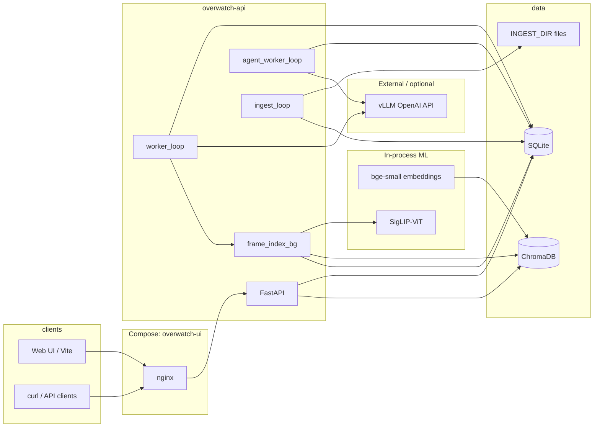

# Overwatch — Technical Report (Engineering)

**Audience:** software engineers, SREs, ML engineers integrating vLLM and SigLIP  
**Scope:** repository as of this document; aligns with `README.md` and source under `src/overwatch/`  
**Approximate length:** ~18 printed pages (dense reference)

---

## 1. Purpose and scope

Overwatch is a **video analytics pipeline** that:

1. Accepts video via **folder ingest** or **HTTP multipart upload**.
2. Decodes video into **time-bounded chunks**, runs a **multimodal LLM** (OpenAI-compatible chat completions with embedded MP4) for observation, then **text-only** specialist passes per chunk.
3. Persists structured results as **events** in SQLite and rolls them into a **job-level summary** (`JobSummaryPayload`).
4. Runs **job-level text agents** over that summary (same vLLM stack), optionally in **linear orchestrations** or **industry-specific static pipelines**.
5. Indexes all analysis text into a **hybrid RAG search system** (ChromaDB vector + BM25 keyword + RRF fusion) so operators can query across all jobs.
6. Extracts keyframes and embeds them with **SigLIP-ViT** for cross-modal search and six automated visual analysis passes: zero-shot alerting, scene change detection, occupancy scoring, diversity keyframe selection, anomaly detection, and image-to-frame similarity search.

**Explicitly out of scope for this report:** product roadmap beyond what exists in code, legal/compliance sign-off for any deployment, and performance benchmarks (unless measured in your environment).

---

## 2. High-level architecture



- **Single API process** hosts HTTP, **job worker**, **agent worker**, **folder ingest** loop, and **frame indexing background tasks** (asyncio tasks, see `main.py` lifespan).
- **SQLite** is the system of record: jobs, events, agent runs, orchestrations, all frame analysis events.
- **ChromaDB** (persistent, on-disk) holds two collections: `overwatch_events` (text embeddings) and `overwatch_frames` (SigLIP image embeddings).
- **vLLM** is accessed over HTTP (`httpx`); no embedded inference server in the default API container.
- **bge-small-en-v1.5** and **SigLIP-ViT** run in-process in a thread pool (`asyncio.to_thread`).

---

## 3. Runtime processes (within the API container)

| Task | Module | Role |
|------|--------|------|
| HTTP server | `overwatch.api.routes` | REST API under `/v1` |
| Job worker | `overwatch.worker.worker_loop` | Claims `pending` jobs, runs chunk pipeline until completed/failed |
| Agent worker | `overwatch.agents.runner.agent_worker_loop` | Claims `pending` `agent_runs`, executes one agent, advances orchestration |
| Folder ingest | `overwatch.ingest.folder.FolderIngest` | Scans `INGEST_DIR`, stable-write detection, creates jobs |
| Stale agent sweep | inside `agent_worker_loop` | Periodic `fail_stale_agent_runs` when queue idle |
| Frame index (bg) | `overwatch.worker._index_frames_background` | Fire-and-forget task after job completes; embeds frames + runs all 6 analysis passes |
| Search backfill | `overwatch.main._backfill_search_index` | Indexes existing completed jobs into ChromaDB on startup |
| Frame backfill | `overwatch.main._backfill_frame_index` | Indexes existing jobs into SigLIP collection on startup |

**Startup / shutdown:** `lifespan` opens DB, initialises `SearchIndexer` and `FrameIndexer` (both blocking — models load before traffic is served), registers background tasks, sets `asyncio.Event` stop on shutdown, cancels all loops and closes connection (`main.py`).

---

## 4. Technology stack

| Layer | Choice |
|-------|--------|
| Language | Python 3.11+ |
| API | FastAPI, Starlette middleware |
| DB | SQLite via `aiosqlite`, schema in `db.py` |
| Config | `pydantic-settings` (`config.py`), env + optional `.env` |
| HTTP client | `httpx` (vLLM, long timeouts for large bodies) |
| Text embeddings | `sentence-transformers` — `BAAI/bge-small-en-v1.5` |
| Vector store | `chromadb` (persistent local, cosine space) |
| Keyword search | `rank-bm25` (in-memory, rebuilt from ChromaDB on startup) |
| Frame embeddings | `transformers` — `google/siglip-base-patch16-224` (~400 MB) |
| Image processing | `Pillow` (frame loading for SigLIP processor) |
| Frame extraction | `ffmpeg` subprocess (temp dir, JPEG, 224×224 padded) |
| Numeric ops | `numpy` (RRF helpers, embedding similarity, k-means ops) |
| Frontend | React + Vite; production build behind nginx |
| Containers | Docker Compose; optional GPU profile for local vLLM |

**Model interface:** OpenAI-style `POST …/chat/completions` with multimodal content (`video_url` data URI) for chunk observation; text-only messages for specialists and job agents.

---

## 5. Data model

### 5.1 Tables (authoritative: `src/overwatch/db.py`)

- **`jobs`** — `id`, `source_type`, `source_path`, `status`, timestamps, `error`, `meta_json`, **`summary_json`** (added by migration).
- **`events`** — append-only log: `job_id`, `observed_at`, optional `frame_index` / `pts_ms`, `agent` (enum string), `event_type`, `severity`, `payload_json`.  
  Frame analysis produces the following event types:  
  `visual_alert` (one per flagged frame), `scene_changes` (one per job, list in payload), `frame_occupancy` (one per job, timeline), `frame_keyframes` (one per job), `frame_anomalies` (one per job, list).
- **`processed_files`** — ingest deduplication: path, fingerprint, `job_id`.
- **`agent_runs`** — async agent queue: `id`, `job_id`, `agent`, `status`, `force_run`, timestamps, `error`, `result_json`, `event_id`, `meta_json` (includes orchestration linkage keys when applicable).
- **`agent_orchestrations`** — multi-step runs: `steps_json`, `current_step`, `force_run`, **`industry_pack`** (nullable), `status`, `error`, timestamps.

Indexes: `events` by `job_id`, `jobs` by `status`, `agent_runs` by job/status, orchestrations by job/status.

### 5.2 Key domain enums (Pydantic / `models.py`)

- **`JobStatus`:** `pending`, `processing`, `completed`, `failed`
- **`AgentTrack`:** pipeline attribution on events (`main_events`, `security`, `logistics`, `attendance`, `pipeline`, `orchestrator`)
- **`AgentKind`:** job-level agents (`synthesis`, `risk_review`, `incident_brief`, `compliance_brief`, `loss_prevention`, `perimeter_chain`, `privacy_review`)
- **`IndustryPack`:** vertical label for named pipelines (`general`, `retail_qsr`, … `healthcare_facilities`)

### 5.3 ChromaDB collections

| Collection | Content | Embedding model | Space |
|------------|---------|----------------|-------|
| `overwatch_events` | Chunk scene summaries, observations, main events, security items, logistics items, agent text outputs | `bge-small-en-v1.5` (384-dim) | cosine |
| `overwatch_frames` | One document per keyframe (placeholder text), with pre-computed SigLIP image embeddings | `siglip-base-patch16-224` (768-dim) | cosine |

Both collections are stored under `DATA_DIR/chroma/` and persist across restarts. The BM25 index is rebuilt in-memory from `overwatch_events` on each startup.

---

## 6. Job lifecycle and chunk pipeline

### 6.1 Job creation

- **API:** `POST /v1/jobs` with `filename` or `source_path` under `INGEST_DIR`; `POST /v1/jobs/upload` streams file to ingest dir and creates job.
- **Ingest:** New stable files get fingerprint; duplicate active job for same path is avoided where enforced in store.

### 6.2 Worker behaviour (summary)

For each claimed job (must have vLLM configured for full behaviour):

1. **Probe** — `ffprobe` extracts duration, codec, resolution, frame rate → `probe` event.
2. **Plan chunks** — temporal segmentation with caps (`VLLM_MAX_CHUNKS_PER_JOB`, segment byte limit, ffmpeg scale, optional audio).
3. **Per chunk:** multimodal **observe** (video → LLM) → structured JSON; **specialists** (main events, security+logistics, attendance counts only); merge to **`ChunkAnalysisMerged`**; append `chunk_analysis` event. Also indexes chunk into `overwatch_events` ChromaDB collection immediately.
4. **Complete job** — build `JobSummaryPayload`, write `summary_json`, set job `completed`.
5. **Frame indexing (async)** — `asyncio.create_task` spawns `_index_frames_background` (fire-and-forget); runs all 6 SigLIP analysis passes and stores results as events.

Failure at any step sets job `failed` with error string; partial events may exist for debugging.

**Reference modules:** `worker.py`, `analysis/chunk_pipeline.py`, `analysis/json_extract.py`, `vllm_client.py`, `search/indexer.py`, `search/frame_indexer.py`, `video/frames.py`.

### 6.3 Chunk analysis passes

| Pass | Input | Model call | Output schema |
|------|-------|-----------|---------------|
| Observe | MP4 bytes | Multimodal | `ObservationsPass` — `scene_summary` + `observations[]` |
| Main events | Obs JSON (text) | Text specialist | `SpecialistMainOut` — `main_events[]` |
| Security + Logistics | Obs JSON (text) | Text specialist | `SpecialistSecLogOut` — `security[]`, `logistics[]` |
| Attendance | Obs JSON (text) | Text specialist | `AttendanceOut` — `approx_people_visible`, `entries`, `exits` |

All four merge into `ChunkAnalysisMerged`.

---

## 7. Job-level agents

All seven agents:

- Input: **`job.summary`** (dict), truncated consistently (~200k chars) inside each agent module when serialized to prompt.
- Output: Pydantic result model → JSON in orchestrator **event** payload + `agent_runs.result_json`.
- **Caching:** If `force_run` is false, worker checks latest successful orchestrator event for that `event_type`; on hit, completes run with `meta.cached` and same result.
- **Post-indexing:** After a successful agent run, the result text is also indexed into `overwatch_events` ChromaDB collection for hybrid search.

**Event type strings** (orchestrator): `agent_synthesis`, `agent_risk_review`, `agent_incident_brief`, `agent_compliance_brief`, `agent_loss_prevention`, `agent_perimeter_chain`, `agent_privacy_review`.

**Dispatch:** `agents/runner.py` maps `AgentKind` → runner function and event type; avoids a long `if/elif` chain via dicts (`_AGENT_RUNNERS`, `_EVENT_TYPE`, `_AGENT_PAYLOAD_ID`).

---

## 8. Orchestration

### 8.1 Single-agent queue

`POST /v1/jobs/{id}/agent-runs` → creates row `pending`; agent worker claims with `UPDATE … RETURNING` (atomic).

### 8.2 Linear custom steps

`POST /v1/jobs/{id}/agent-runs/orchestrate` — body `steps: AgentKind[]` (max 24). First run enqueued with `meta.orchestration_id`, `orch_step`, `orch_steps`. On each terminal success, `notify_agent_orchestration_terminal` enqueues next or marks orchestration `completed`. On failure, orchestration `failed`.

**Concurrency rule:** at most one orchestration with `status=running` per job (`409` on conflict).

### 8.3 Industry static graphs

`POST /v1/jobs/{id}/agent-runs/orchestrate/industry` — body `industry: IndustryPack`. Steps resolved by `industry_pipelines.pipeline_for()`. **`industry_pack`** persisted on `agent_orchestrations` for audit and returned in GET responses.

**11 industry packs** with curated agent ordering: `general`, `retail_qsr`, `logistics_warehouse`, `manufacturing`, `commercial_real_estate`, `transportation_hubs`, `critical_infrastructure`, `banking_atm`, `hospitality_venues`, `education_campus`, `healthcare_facilities`.

**Design intent:** explicit, version-controlled graphs per vertical before introducing LLM-driven routing or conditional DAGs.

---

## 9. Hybrid RAG search

### 9.1 Overview

The search subsystem lives under `src/overwatch/search/` and provides **hybrid ranked retrieval** (vector + keyword + frame) with optional LLM answer synthesis. All components are optional — if `SEARCH_ENABLED=false` or required packages are missing, the system degrades gracefully with 503 responses on search routes.

### 9.2 Text search indexer (`search/indexer.py`)

**`SearchIndexer`** maintains two parallel indexes over the same document corpus:

1. **ChromaDB vector index** — each document is embedded with `bge-small-en-v1.5` (sentence-transformers) and upserted to the `overwatch_events` collection. Upserts are idempotent (deterministic IDs).
2. **In-memory BM25** — `rank_bm25.BM25Okapi` over tokenized documents. Rebuilt at startup by loading all documents from ChromaDB; protected by `threading.Lock`.

**Indexed content (per chunk):** `scene_summary`, individual `observations`, `main_events`, `security` items, `logistics` items.

**Indexed content (per agent run):** agent output text extracted by `_flatten_agent_result()`.

All indexing calls are wrapped in `asyncio.to_thread()` to avoid blocking the event loop.

### 9.3 Frame indexer (`search/frame_indexer.py`)

**`FrameIndexer`** is an independent component that embeds video keyframes with **SigLIP-ViT** and stores the float32 vectors in the `overwatch_frames` ChromaDB collection. No pixel data is ever persisted.

**Initialization:** loads `google/siglip-base-patch16-224` via `transformers`, auto-selects CUDA/CPU, pre-computes embeddings for all alert prompts and occupancy probe pair.

**Frame extraction pipeline:** `ffmpeg` → temp directory → 224×224 padded JPEG → `PIL.Image` → SigLIP image encoder → L2-normalized float32 vector.

### 9.4 Hybrid retrieval and RRF (`search/retrieval.py`)

**`SearchRetriever.search(query)`** executes three parallel retrievals, then fuses with **Reciprocal Rank Fusion**:

```
score(doc) = Σ  1 / (k + rank_in_list_i + 1)    k = 60
             i ∈ {vector, BM25, SigLIP-frame}
```

Filtering (by `job_ids`, `agent_types`, `severity`) is applied to ChromaDB via `where` clauses for efficiency, then enforced again post-fusion for BM25/frame hits that bypass the ChromaDB filter.

**Optional LLM answer synthesis:** top results are assembled into a context window (capped at 12k chars) and sent to vLLM for a 2–4 sentence answer.

### 9.5 Startup backfill

On startup, `_backfill_search_index` and `_backfill_frame_index` run as background tasks to index any completed jobs that pre-date or survived a restart. Limited by `SEARCH_BACKFILL_LIMIT=200`.

---

## 10. SigLIP visual analysis features

All six analysis passes run over the **same set of pre-computed frame embeddings** during `index_video_frames()`. This means embeddings are computed exactly once per frame; analysis costs are minimal marginal overhead.

### Feature 1 — Zero-shot visual alerting

Configurable text alert prompts (default: fall, fire, fence-climbing, blocked exit, forklift near pedestrian, unattended bag) are embedded at `initialize()` time. For each frame, the cosine similarity to every alert prompt is computed. Frames where `sim ≥ VISUAL_ALERT_THRESHOLD` emit `visual_alert` events with `pts_ms`, prompt text, and score. Severity: `high` if score ≥ 0.35, else `medium`.

**Why it works:** SigLIP's shared text-image embedding space assigns high cosine similarity to (image, description) pairs even when neither was seen during training — classic zero-shot classification.

### Feature 2 — Scene change detection

Consecutive frame embedding pairs are compared by cosine distance (`1 - dot(e_i, e_{i+1})`). Distance above `SCENE_CHANGE_THRESHOLD=0.25` is flagged as a cut. Results stored in a single `scene_changes` event per job.

### Feature 3 — Occupancy density scoring

Two probe embeddings are pre-computed: `"an empty area with no people visible"` and `"a crowded area with many people"`. For each frame:

```
occupancy_score = clip((sim(frame, crowd) - sim(frame, empty) + 1) / 2, 0, 1)
```

Results stored as a `frame_occupancy` event (full timeline, O(n_frames) payload). Visualised as a colour-coded bar chart in the UI.

### Feature 4 — Image-to-frame similarity search

`FrameIndexer.search_by_image(jpeg_bytes, n_results, job_ids)` embeds the query image with SigLIP's **image encoder** (same embedding space as stored frame vectors) and queries ChromaDB. Accessible via `POST /v1/search/by-image` (multipart upload) and the **🖼 Image search** tab in the UI.

### Feature 5 — Visual diversity keyframes

Greedy farthest-point sampling selects `FRAME_KEYFRAME_COUNT=8` (configurable) frames that are maximally spread in the SigLIP embedding space:

1. Seed: frame with highest cosine similarity to the global mean (most representative).
2. Repeat: add the frame with the **lowest maximum similarity** to any already-selected frame.

Results stored as `frame_keyframes` event. Provides a visual storyboard without requiring thumbnail storage.

### Feature 6 — Baseline anomaly detection

The per-job centroid is the L2-normalised mean of all frame embeddings. Frames with cosine distance from centroid above `ANOMALY_THRESHOLD=0.30` are flagged. Results stored as `frame_anomalies` event. These frames are visually unlike the bulk of the recording — useful for surfacing unexpected events missed by the LLM analysis.

---

## 11. HTTP API surface

Base path: **`/v1`** (Compose also exposes `/api/*` → same API from UI).

| Area | Methods | Notes |
|------|---------|--------|
| Health | `GET /health` | Returns `search` and `frame_search` status |
| Jobs | `GET/POST /jobs`, `GET/DELETE /jobs/{id}`, upload | `DELETE` also removes ChromaDB docs and frame embeddings |
| Events | `GET /jobs/{id}/events` | Pagination `after_id`, `limit`; `legacy=true` full dump |
| Summary | `GET /jobs/{id}/summary` | 404 until summary exists |
| Agent runs | `POST …/agent-runs`, `GET /agent-runs/{id}`, list by job | 202 async |
| Orchestrate | `POST …/agent-runs/orchestrate`, `POST …/orchestrate/industry` | 409 if orchestration running |
| Orchestration status | `GET /agent-orchestrations/{id}`, list by job | Includes `industry_pack` when set |
| Latest agent payloads | `GET …/agents/{kind}` | One route per agent family |
| Search (text) | `POST /search` | Hybrid RAG; optional `synthesize_answer`, `include_frames` |
| Search (image) | `POST /search/by-image` | Multipart image upload; SigLIP image encoder |
| Search index status | `GET /search/index-status` | Doc count, frame count, model names |
| Job search status | `GET /jobs/{id}/search-status` | Per-job doc + frame counts |
| Job reindex | `POST /jobs/{id}/search-reindex` | Rebuild text + frame index for one job |
| Visual alerts | `GET /jobs/{id}/visual-alerts` | All `visual_alert` events for job |
| Scene changes | `GET /jobs/{id}/scene-changes` | `scene_changes` event payload |
| Occupancy | `GET /jobs/{id}/occupancy` | `frame_occupancy` timeline |
| Keyframes | `GET /jobs/{id}/keyframes` | `frame_keyframes` storyboard |
| Anomalies | `GET /jobs/{id}/anomalies` | `frame_anomalies` list |

**Contract discovery:** FastAPI `/docs`, `/redoc`, `openapi.json` (proxied in Compose).

---

## 12. Cross-cutting concerns

### 12.1 Middleware (order: outer → inner on request)

1. **RequestLogMiddleware** — `X-Request-Id`, latency log at INFO.
2. **CORS** — configurable origins; Compose same-origin UI often bypasses need.
3. **ApiRateLimitMiddleware** — in-memory sliding window per client key (`X-Forwarded-For` first); disabled when `API_RATE_LIMIT_PER_MINUTE=0`. Health/docs/openapi exempt.

### 12.2 Concurrency model

All blocking operations (ChromaDB reads/writes, BM25 search, SigLIP inference, ffmpeg frame extraction) are wrapped in `asyncio.to_thread()`. The SigLIP `initialize()` call is also dispatched to a thread, meaning model download and weight loading do not block the FastAPI startup (`lifespan` awaits the thread before yielding).

Frame indexing after job completion is fire-and-forget (`asyncio.create_task`) — the job is marked `completed` before frame embedding starts.

### 12.3 Observability

- Structured-ish logs: `overwatch.http`, worker exceptions, `vllm_client` chat completion duration + status, frame indexer progress (frame count, alert count, anomaly count per job).
- No distributed tracing in-tree; single process.

### 12.4 Security posture (engineering reality)

- **No authentication/authorization** on API in current codebase — treat as internal network or add gateway auth.
- **Upload limits** and optional **rate limiting** reduce abuse surface.
- **Secrets:** `VLLM_API_KEY`, `HF_TOKEN` (local vLLM profile) via env — never commit.

### 12.5 Privacy product rules

- Attendance path designed for **counts only**; **privacy_review** agent flags risky wording in structured summary; not a substitute for legal review.
- Frame embeddings store **no pixel data** — only float32 vectors and metadata (`pts_ms`, `job_id`, `source_path`). The SigLIP pipeline is explicitly designed so that raw image data cannot be reconstructed from stored embeddings.

---

## 13. Configuration reference

Environment variables are loaded via `Settings` (`config.py`). High-impact knobs:

| Category | Variables |
|----------|-----------|
| Paths | `DATA_DIR`, `INGEST_DIR` |
| Ingest | `INGEST_POLL_INTERVAL_SEC`, `INGEST_STABLE_SEC`, `INGEST_EXTENSIONS` |
| vLLM core | `VLLM_BASE_URL`, `VLLM_MODEL`, `VLLM_API_KEY` |
| Chunk / multimodal | `VLLM_MAX_CHUNKS_PER_JOB`, `VLLM_CHUNK_TIMEOUT_SEC`, `VLLM_CHUNK_MAX_TOKENS`, `VLLM_SEGMENT_MAX_BYTES`, `VLLM_VIDEO_SCALE_WIDTH`, `VLLM_SEGMENT_INCLUDE_AUDIO`, `VLLM_MULTIMODAL_ENABLED` |
| Text specialists | `VLLM_SPECIALIST_MAX_TOKENS`, `VLLM_JSON_RETRY_MAX` |
| Job agents | `VLLM_AGENT_MAX_TOKENS`, `VLLM_AGENT_TIMEOUT_SEC` |
| Workers | `WORKER_POLL_INTERVAL_SEC`, `AGENT_WORKER_POLL_INTERVAL_SEC` |
| Hardening | `MAX_UPLOAD_BYTES`, `AGENT_RUN_STALE_SEC`, `API_RATE_LIMIT_PER_MINUTE` |
| CORS | `CORS_ORIGINS` |
| Text search | `SEARCH_ENABLED`, `SEARCH_EMBEDDING_MODEL`, `SEARCH_BACKFILL_LIMIT`, `SEARCH_ANSWER_ENABLED` |
| Frame search | `FRAME_SEARCH_ENABLED`, `FRAME_EMBED_MODEL`, `FRAME_SAMPLE_FPS`, `FRAME_MAX_FRAMES_PER_JOB` |
| Visual alerting | `VISUAL_ALERT_ENABLED`, `VISUAL_ALERT_PROMPTS` (comma-separated), `VISUAL_ALERT_THRESHOLD` |
| Scene detection | `SCENE_CHANGE_ENABLED`, `SCENE_CHANGE_THRESHOLD` |
| Occupancy | `OCCUPANCY_SCORING_ENABLED` |
| Keyframes | `FRAME_KEYFRAME_COUNT` |
| Anomaly | `ANOMALY_DETECTION_ENABLED`, `ANOMALY_THRESHOLD` |

Compose passes a subset explicitly; others rely on defaults or host `.env`.

---

## 14. Frontend

- **Dev:** Vite dev server, `/api/*` → `http://127.0.0.1:8080/v1/*`.
- **Prod (Compose):** Static assets + nginx gateway on port 80; proxies `/v1/`, `/api/`, docs, health.

**Features:**
- Upload or path-based job creation; recent jobs polling with auto-refresh.
- Per-job summary panel, per-chunk events, per-agent result panels.
- Core / cross-industry / industry-pack orchestration buttons.
- **Search panel** with two modes:
  - *Text search* — hybrid RAG with filters (video scope, agent type, severity), AI answer toggle, frame search toggle (🎞), live frame count from index.
  - *Image search* — drag-drop or click-to-pick image, POSTs to `/v1/search/by-image`, renders visually similar frame results.
- Frame search results rendered with 🎞 icon, blue tint, and italic text to distinguish from text analysis results.
- **Frame Analysis panel** (per completed job, 5 tabs):
  - *Visual Alerts* — list of SigLIP-flagged frames with prompt, severity badge, timestamp, score.
  - *Occupancy* — colour-coded bar chart of crowd density over time.
  - *Keyframes* — storyboard grid of diverse representative timestamps.
  - *Scene Changes* — list of detected cuts with cosine distance.
  - *Anomalies* — frames far from the job's visual centroid.
- `JobSearchBadge` shows indexed doc count + frame count + one-click reindex button.

---

## 15. Testing

```bash
PYTHONPATH=src python -m unittest discover -s tests -p 'test_*.py' -v
```

**Modules covered (representative):** JSON extraction, chunk planning, agent run store + stale failure, orchestration advancement, industry pipeline definitions, each job-level agent with mocked vLLM.

**Gaps (honest):** no full HTTP integration suite in repo; no load tests; no golden eval for agent quality; no unit tests for search/frame indexer (require heavy ML deps and large test fixtures).

---

## 16. Deployment (Compose)

- **Services:** `overwatch-api` (build from repo Dockerfile), `overwatch-ui` (frontend Dockerfile), optional `vllm-server` (`--profile local-vllm`).
- **Volumes:** `./data/ingest`, `./data/overwatch` → `/data/ingest`, `/data/overwatch`.
- **ChromaDB data** is stored inside the `./data/overwatch/chroma/` volume — persisted across restarts. First startup with `FRAME_SEARCH_ENABLED=true` will download the SigLIP model (~400 MB from HuggingFace Hub); ensure `HF_HOME` or `TRANSFORMERS_CACHE` is volume-mounted to avoid re-downloading on every container restart.
- **Health:** API `curl` healthcheck; UI `depends_on` API healthy.
- **Host port 80:** may require elevated/rootless Docker port mapping adjustments (see README).
- **GPU:** `FRAME_SEARCH_ENABLED=true` benefits from a CUDA-capable GPU for SigLIP inference. The code auto-selects CUDA if available via `torch.cuda.is_available()`; no code changes required.

---

## 17. Known limitations and extension points

| Limitation | Implication |
|------------|-------------|
| Summary-bound agents | Quality ceiling = chunk pipeline + summary fidelity |
| Single SQLite file | Throughput and HA not designed for multi-writer scale-out |
| Single API replica | Agent/job workers are in-process; horizontal scale needs redesign |
| No auth | Must be network-segmented or wrapped |
| Static industry graphs only | Conditional branches / LLM router not implemented |
| BM25 in-memory | Lost on restart, rebuilt from ChromaDB on startup (adds ~seconds per 1k docs) |
| SigLIP thresholds uncalibrated | Default `VISUAL_ALERT_THRESHOLD=0.20` is approximate; requires tuning per scene type |
| No pixel storage for keyframes | Storyboard shows timestamps only, no thumbnail previews |
| Frame count vs unique IDs | A person appearing across multiple chunks counts once per chunk in `approx_people_visible` |

**Extension points:**
- Enrich `JobSummaryPayload` / chunk merges with additional specialist passes.
- Add conditional orchestration branches after risk/privacy scores.
- External queue (Redis/SQS) for worker decoupling and horizontal scale.
- Dedicated CV person-detection pipeline (YOLOv8 / RT-DETR) for precise headcounts.
- Per-camera baseline collections for cross-job anomaly detection.
- OpenAPI-first SDK generation.
- SigLIP fine-tuning on domain-specific (warehouse, retail, hospital) image-text pairs to improve alert precision.

---

## 18. Appendix: repository map

| Path | Responsibility |
|------|----------------|
| `src/overwatch/main.py` | FastAPI app, lifespan, middleware stack, search + frame indexer init, backfills |
| `src/overwatch/config.py` | Settings / env (50+ variables) |
| `src/overwatch/db.py` | SQLite schema + migrations |
| `src/overwatch/store.py` | Persistence API |
| `src/overwatch/api/routes.py` | REST endpoints (all routes including search, frame analysis) |
| `src/overwatch/worker.py` | Job processing loop, frame indexing bg task, event storage helper |
| `src/overwatch/agents/runner.py` | Agent execution + orchestration hooks |
| `src/overwatch/agents/orchestration.py` | Orchestration advance/fail |
| `src/overwatch/agents/*.py` | Per-agent LLM modules |
| `src/overwatch/industry_pipelines.py` | `INDUSTRY_PIPELINES`, `pipeline_for()` |
| `src/overwatch/models.py` | Pydantic models, `IndustryPack`, `AgentKind`, orchestration DTOs |
| `src/overwatch/vllm_client.py` | HTTP client to OpenAI-compatible API |
| `src/overwatch/analysis/chunk_pipeline.py` | 4-pass chunk analysis, `job_summary_from_chunks` |
| `src/overwatch/analysis/json_extract.py` | JSON repair / extraction from LLM output |
| `src/overwatch/video/probe.py` | ffprobe wrapper |
| `src/overwatch/video/chunks.py` | Chunk planner |
| `src/overwatch/video/segment.py` | ffmpeg MP4 segment extractor (async) |
| `src/overwatch/video/frames.py` | ffmpeg keyframe extractor → (pts_ms, jpeg_bytes) pairs (sync, for thread pool) |
| `src/overwatch/search/__init__.py` | Package marker |
| `src/overwatch/search/models.py` | `SearchQuery`, `SearchResponse`, `SearchResult`, `SearchSource`, `SearchIndexStatus` |
| `src/overwatch/search/indexer.py` | `SearchIndexer` — ChromaDB + BM25 text index |
| `src/overwatch/search/frame_indexer.py` | `FrameIndexer` — SigLIP frame embeddings + all 6 visual analysis passes |
| `src/overwatch/search/retrieval.py` | `SearchRetriever` — hybrid RRF fusion + LLM answer synthesis |
| `src/overwatch/middleware/` | Request log, rate limit |
| `frontend/src/App.tsx` | Main React app, job detail, FrameAnalysisPanel |
| `frontend/src/SearchPanel.tsx` | Hybrid search UI + image search tab |
| `frontend/src/api.ts` | API client functions and TypeScript types |
| `frontend/src/App.css` | Stylesheet |
| `compose.yml` | Service wiring |
| `tests/` | Unit tests |
| `docs/technical_report.md` | This document |

---

*End of report.*
